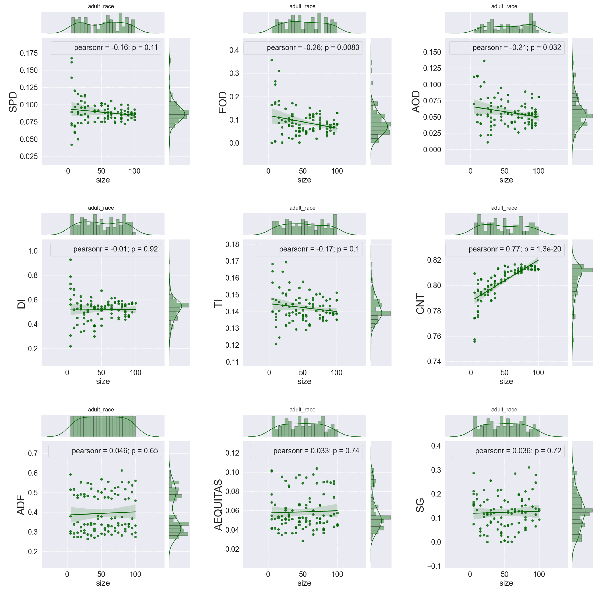
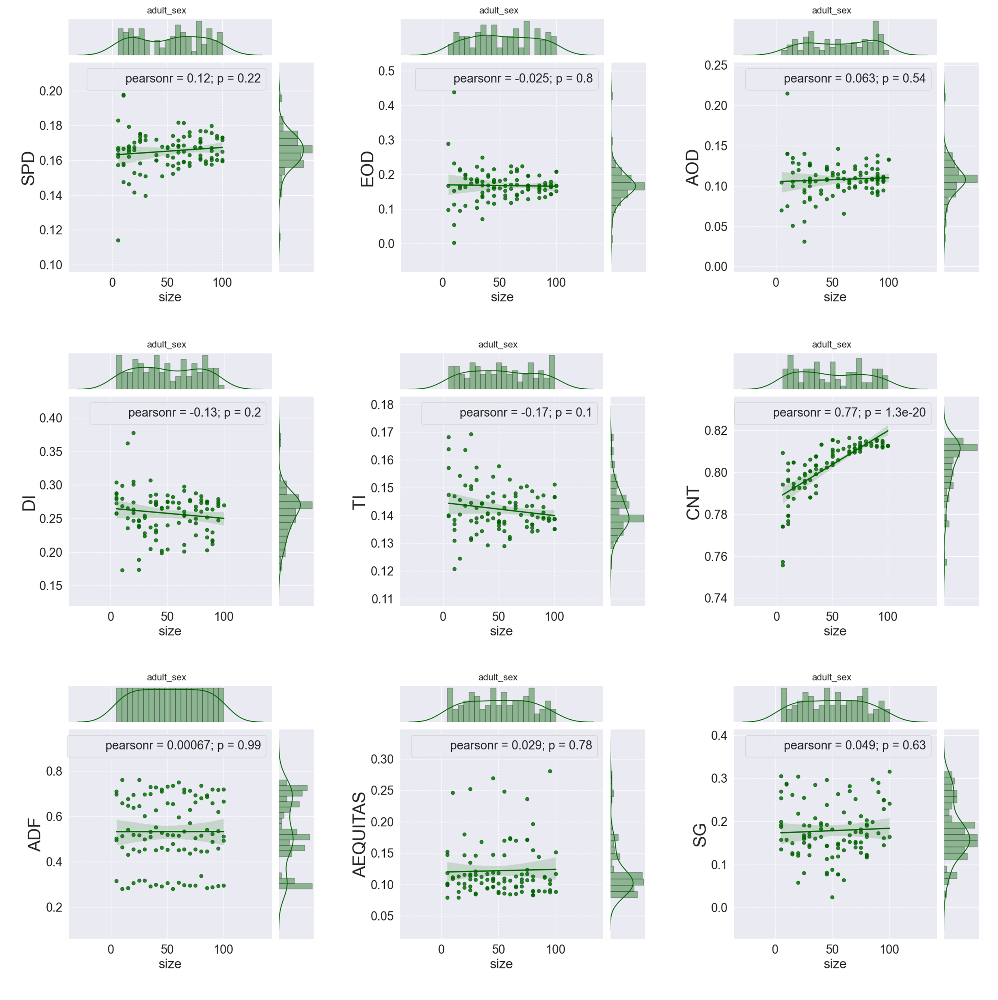
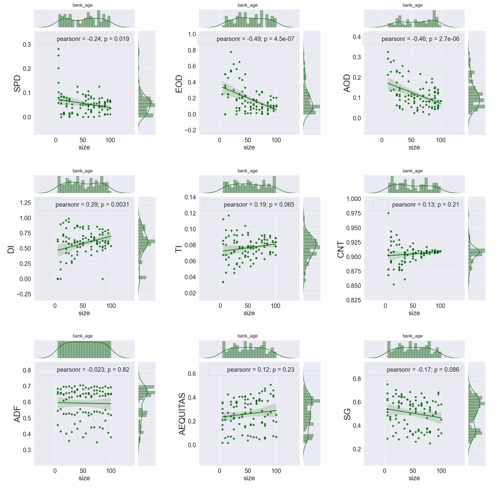
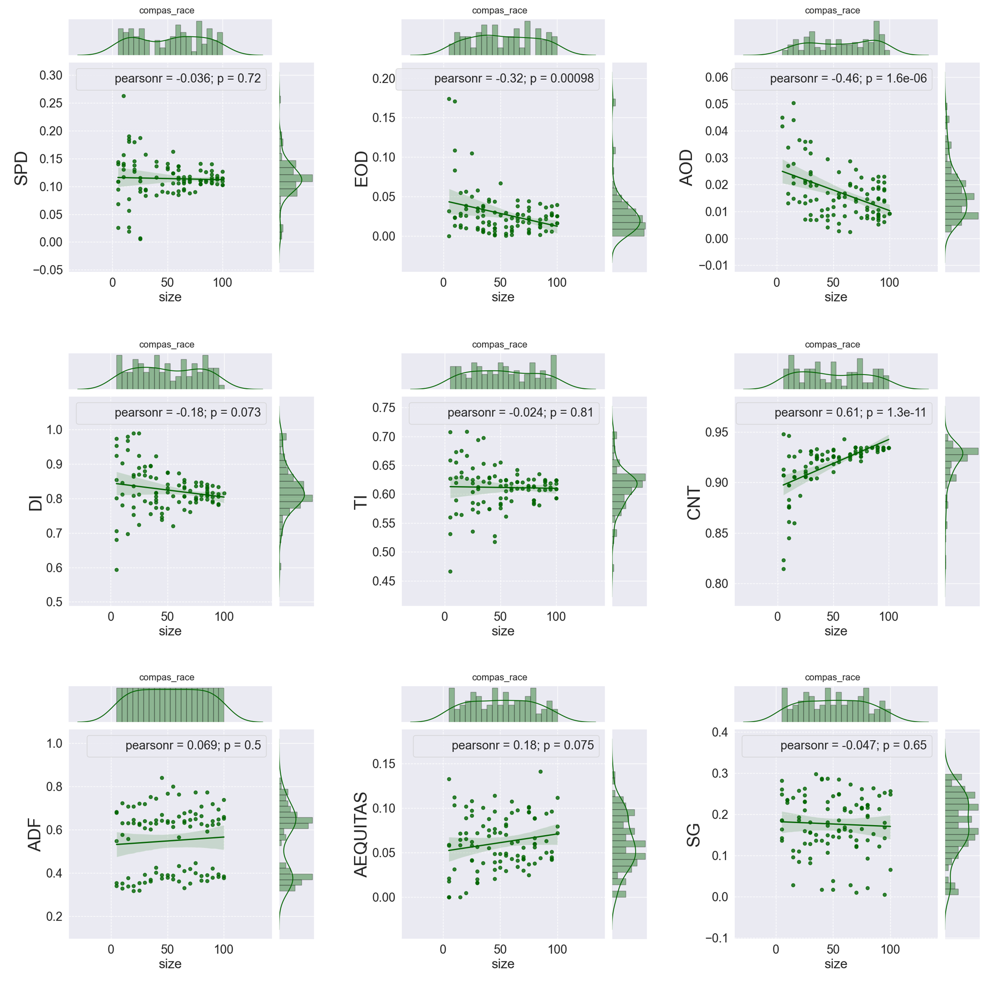
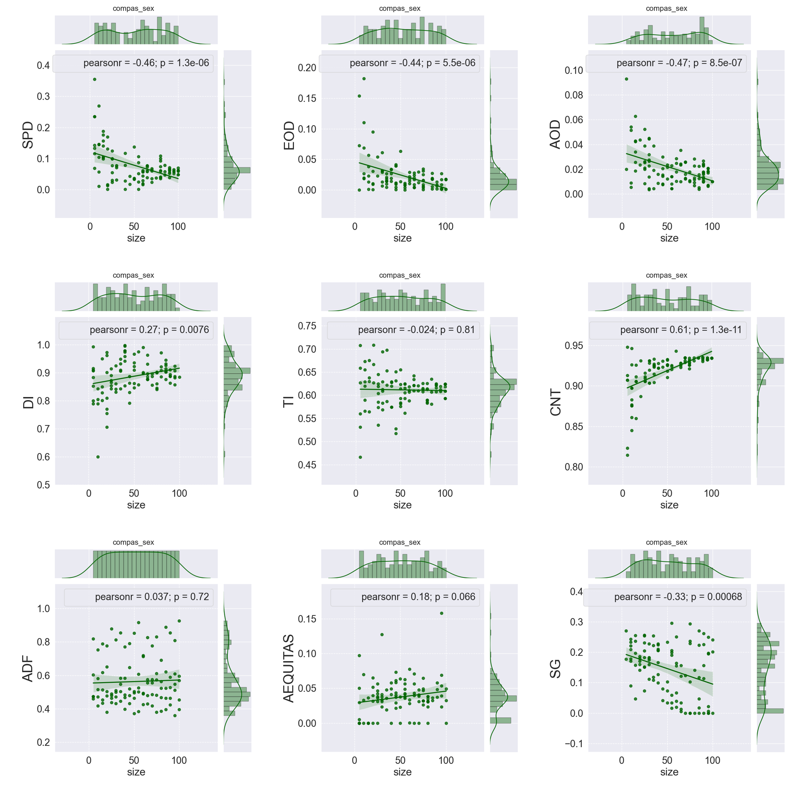
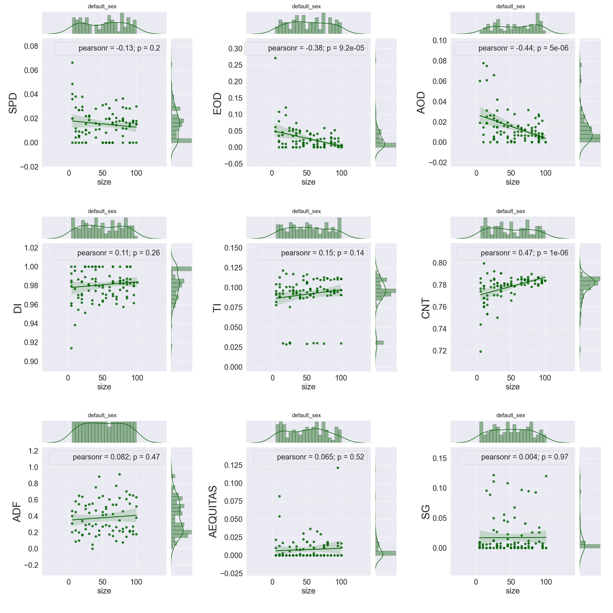
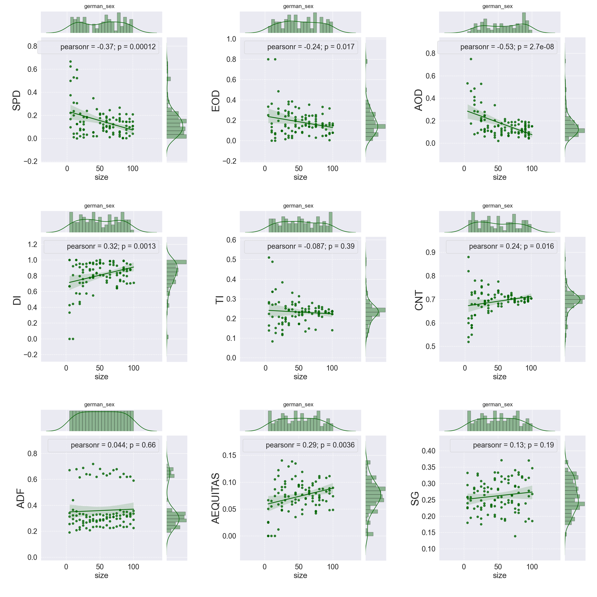
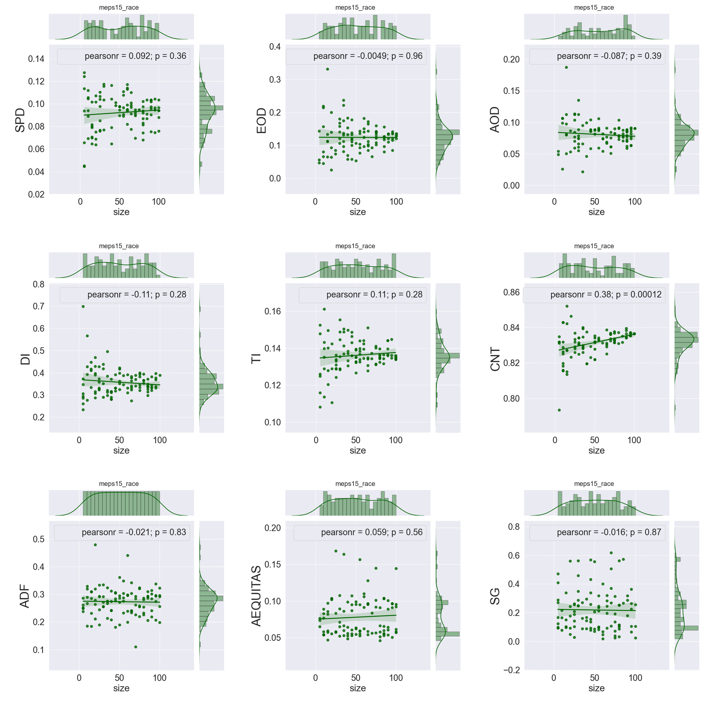
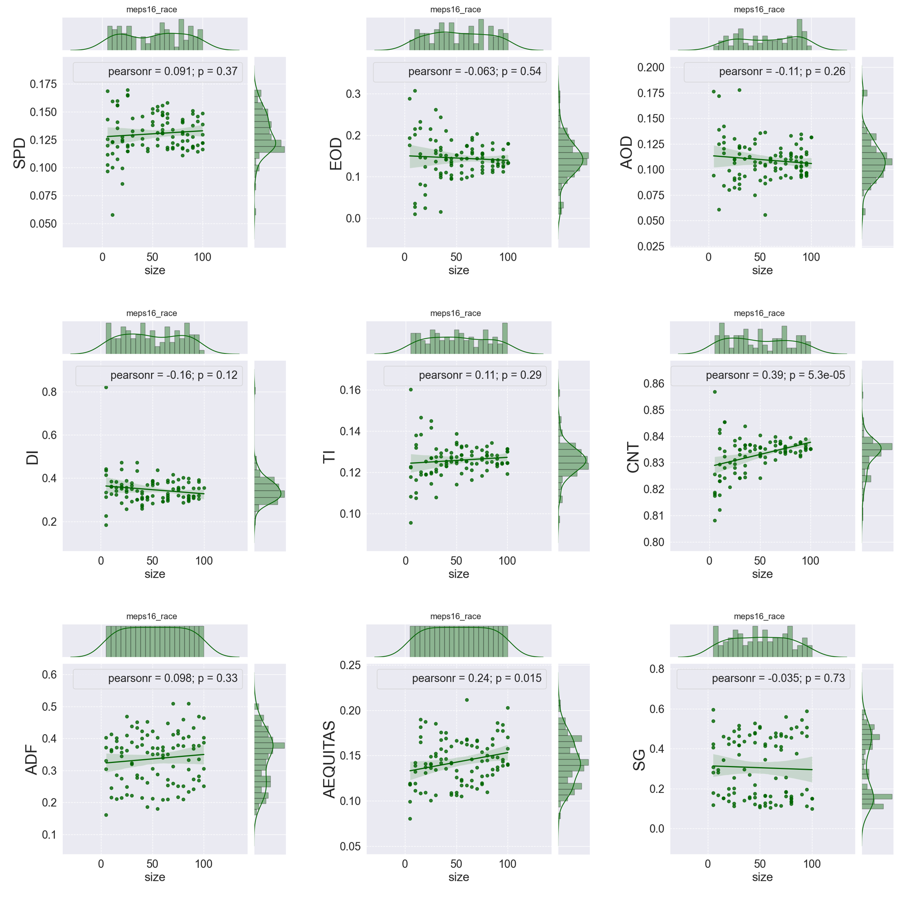
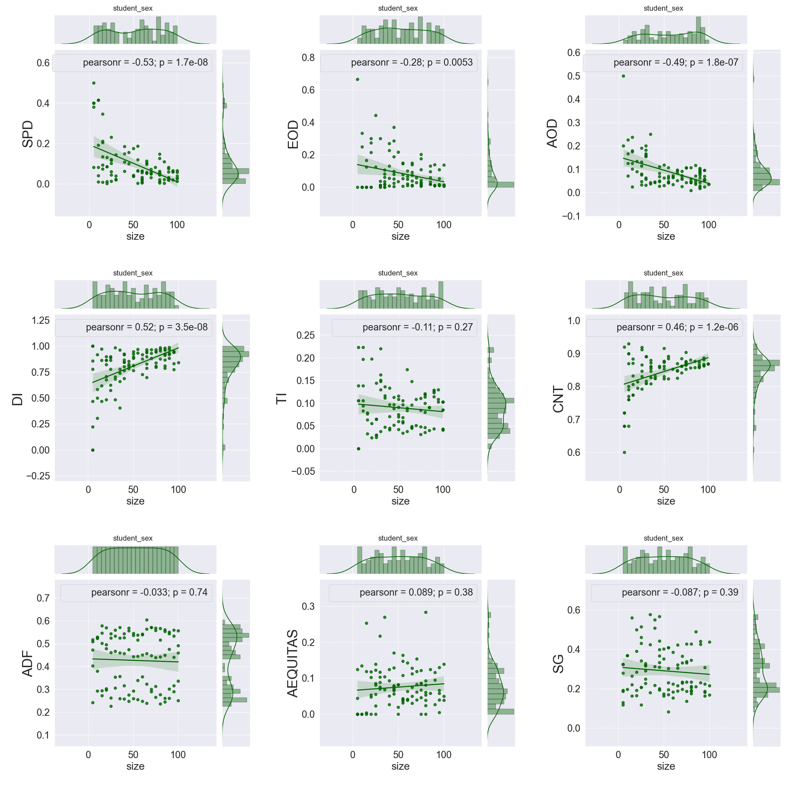

#### rq1.2_relative_adult_race

#### rq1.2_relative_adult_sex

#### rq1.2_relative_bank_age

#### rq1.2_relative_compas_race

#### rq1.2_relative_compas_sex

#### rq1.2_relative_default_sex

#### rq1.2_relative_german_sex

#### rq1.2_relative_heart_age

#### rq1.2_relative_meps15_race

#### rq1.2_relative_meps16_race

#### rq1.2_relative_students_sex

